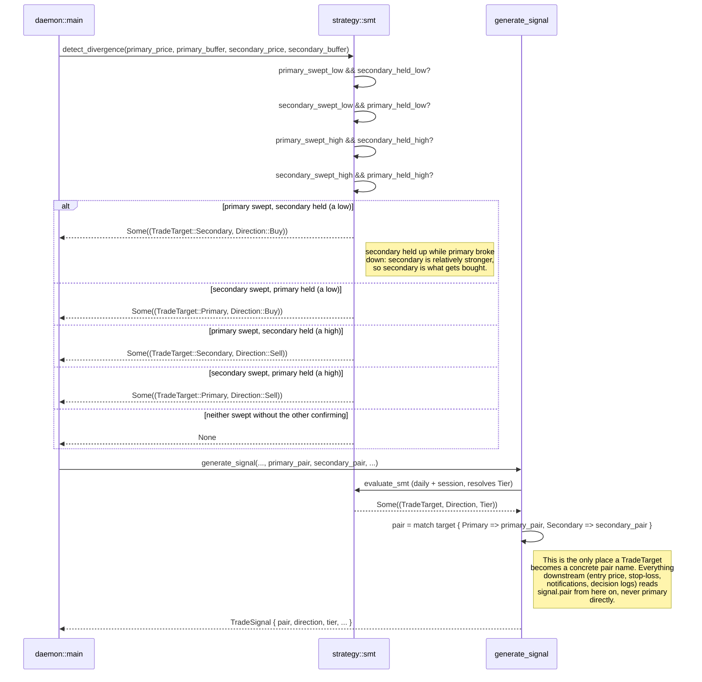

# Sequence: SMT Divergence to Traded Pair

How `TradeTarget` resolves into an actual pair name, and why the rule doesn't care which asset is labeled "primary."

```mermaid
sequenceDiagram
    participant Main as daemon::main
    participant Smt as strategy::smt
    participant Signal as generate_signal

    Main->>Smt: detect_divergence(primary_price, primary_buffer, secondary_price, secondary_buffer)

    Smt->>Smt: primary_swept_low && secondary_held_low?
    Smt->>Smt: secondary_swept_low && primary_held_low?
    Smt->>Smt: primary_swept_high && secondary_held_high?
    Smt->>Smt: secondary_swept_high && primary_held_high?

    alt primary swept, secondary held (a low)
        Smt-->>Main: Some((TradeTarget::Secondary, Direction::Buy))
        note right of Smt: secondary held up while primary broke<br/>down: secondary is relatively stronger,<br/>so secondary is what gets bought.
    else secondary swept, primary held (a low)
        Smt-->>Main: Some((TradeTarget::Primary, Direction::Buy))
    else primary swept, secondary held (a high)
        Smt-->>Main: Some((TradeTarget::Secondary, Direction::Sell))
    else secondary swept, primary held (a high)
        Smt-->>Main: Some((TradeTarget::Primary, Direction::Sell))
    else neither swept without the other confirming
        Smt-->>Main: None
    end

    Main->>Signal: generate_signal(..., primary_pair, secondary_pair, ...)
    Signal->>Smt: evaluate_smt (daily + session, resolves Tier)
    Smt-->>Signal: Some((TradeTarget, Direction, Tier))
    Signal->>Signal: pair = match target { Primary => primary_pair, Secondary => secondary_pair }
    note right of Signal: This is the only place a TradeTarget<br/>becomes a concrete pair name. Everything<br/>downstream (entry price, stop-loss,<br/>notifications, decision logs) reads<br/>signal.pair from here on, never primary<br/>directly.
    Signal-->>Main: TradeSignal { pair, direction, tier, ... }
```
