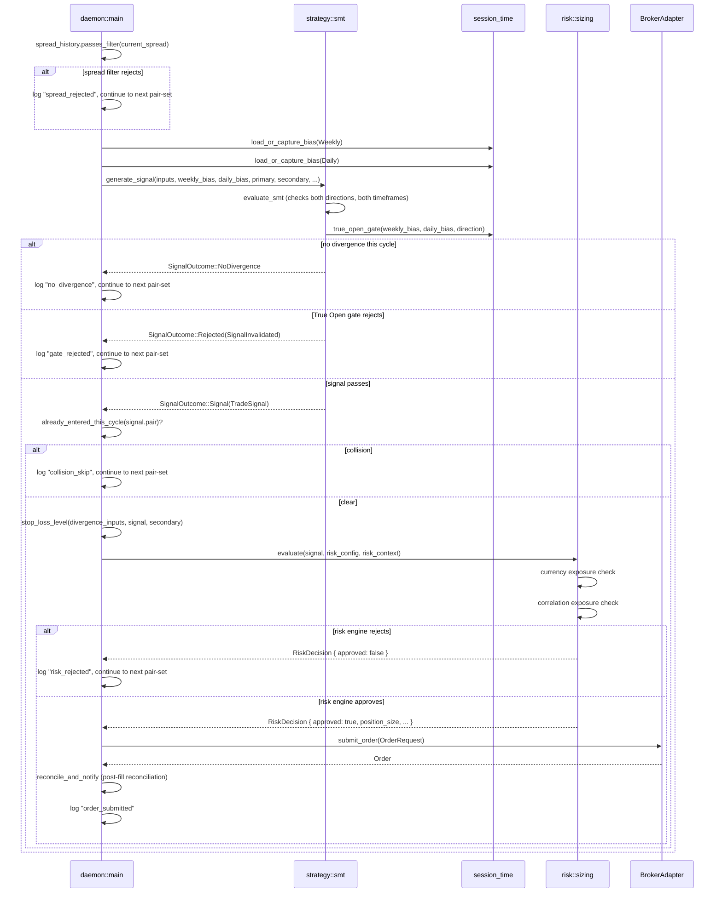

# Sequence: One Pair-Set's Entry Evaluation

Everything account-wide (health, kill switch, the window/holiday gates, the broker snapshot itself) has already happened before this point; this is what runs once per configured pair-set.

