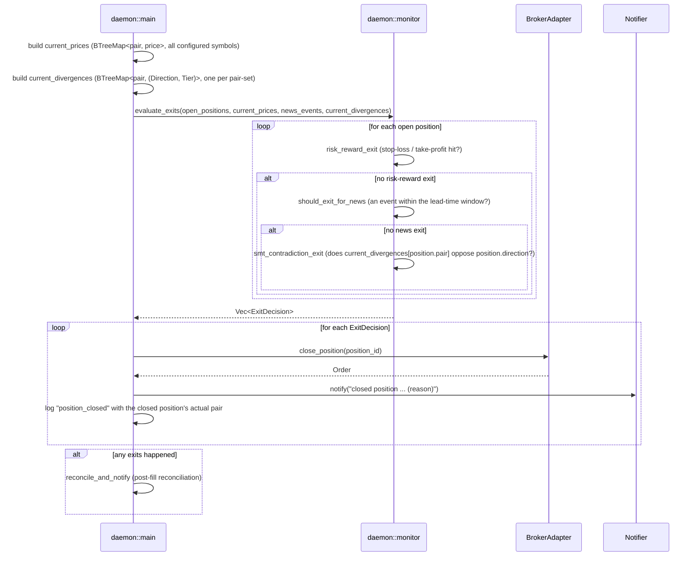

# Sequence: Exit Sweep

Runs every invocation, for every currently open position regardless of which pair-set it came from, independent of whether this cycle is inside an entry window.

```mermaid
sequenceDiagram
    participant Main as daemon::main
    participant Monitor as daemon::monitor
    participant Broker as BrokerAdapter
    participant Notifier

    Main->>Main: build current_prices (BTreeMap<pair, price>, all configured symbols)
    Main->>Main: build current_divergences (BTreeMap<pair, (Direction, Tier)>, one per pair-set)
    Main->>Monitor: evaluate_exits(open_positions, current_prices, news_events, current_divergences)

    loop for each open position
        Monitor->>Monitor: risk_reward_exit (stop-loss / take-profit hit?)
        alt no risk-reward exit
            Monitor->>Monitor: should_exit_for_news (an event within the lead-time window?)
            alt no news exit
                Monitor->>Monitor: smt_contradiction_exit (does current_divergences[position.pair] oppose position.direction?)
            end
        end
    end

    Monitor-->>Main: Vec<ExitDecision>

    loop for each ExitDecision
        Main->>Broker: close_position(position_id)
        Broker-->>Main: Order
        Main->>Notifier: notify("closed position ... (reason)")
        Main->>Main: log "position_closed" with the closed position's actual pair
    end

    alt any exits happened
        Main->>Main: reconcile_and_notify (post-fill reconciliation)
    end
```
