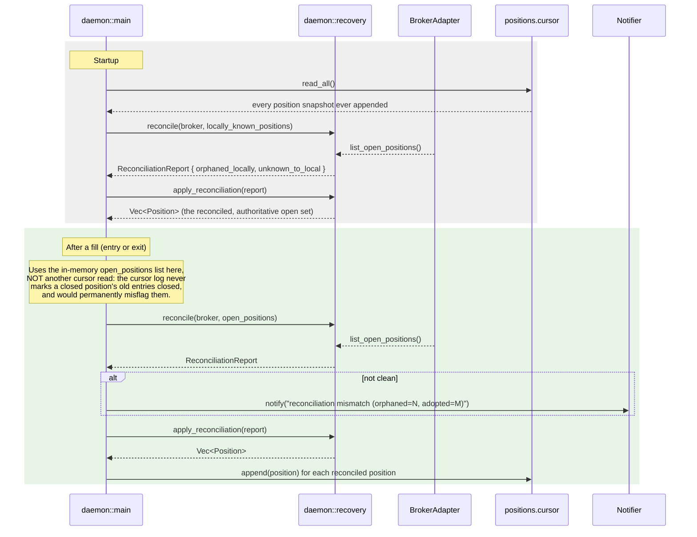

# Sequence: Reconciliation

Runs at startup, and again immediately after every fill (an entry or an exit): not only at the next invocation's startup.

```mermaid
sequenceDiagram
    participant Main as daemon::main
    participant Recovery as daemon::recovery
    participant Broker as BrokerAdapter
    participant Cursor as positions.cursor
    participant Notifier

    rect rgb(240, 240, 240)
        note over Main: Startup
        Main->>Cursor: read_all()
        Cursor-->>Main: every position snapshot ever appended
        Main->>Recovery: reconcile(broker, locally_known_positions)
        Broker-->>Recovery: list_open_positions()
        Recovery-->>Main: ReconciliationReport { orphaned_locally, unknown_to_local }
        Main->>Recovery: apply_reconciliation(report)
        Recovery-->>Main: Vec<Position> (the reconciled, authoritative open set)
    end

    rect rgb(230, 245, 230)
        note over Main: After a fill (entry or exit)
        note over Main: Uses the in-memory open_positions list here,<br/>NOT another cursor read: the cursor log never<br/>marks a closed position's old entries closed,<br/>and would permanently misflag them.
        Main->>Recovery: reconcile(broker, open_positions)
        Broker-->>Recovery: list_open_positions()
        Recovery-->>Main: ReconciliationReport
        alt not clean
            Main->>Notifier: notify("reconciliation mismatch (orphaned=N, adopted=M)")
        end
        Main->>Recovery: apply_reconciliation(report)
        Recovery-->>Main: Vec<Position>
        Main->>Cursor: append(position) for each reconciled position
    end
```
